# 🐳 Docker Journey — From Scratch to Production

> A complete Docker learning path — from zero to production-ready. Every phase builds on the previous one. This repo never ends — it grows as the journey grows.

---

## 🗺️ Journey Architecture

```mermaid
flowchart TD
    A([🌱 START — Zero Knowledge]) --> B

    subgraph P1["📦 PHASE 1 — Foundation"]
        B[What is Docker?]
        B --> B1[Docker vs Virtual Machine]
        B1 --> B2[Docker Architecture\nClient · Daemon · Registry]
        B2 --> B3[Installation on Linux/Ubuntu]
        B3 --> B4[Docker CLI — First Commands]
    end

    B4 --> C

    subgraph P2["🖼️ PHASE 2 — Images & Containers"]
        C[Docker Images]
        C --> C1[Pull · List · Remove Images]
        C1 --> C2[Run · Stop · Exec · Logs]
        C2 --> C3[Dockerfile — Writing from Scratch]
        C3 --> C4[Build Custom Images]
        C4 --> C5[Image Layers & Cache]
        C5 --> C6[Push to Docker Hub]
    end

    C6 --> D

    subgraph P3["🌐 PHASE 3 — Networking & Volumes"]
        D[Docker Networking]
        D --> D1[Bridge · Host · None Networks]
        D1 --> D2[Custom Networks]
        D2 --> D3[Docker Volumes]
        D3 --> D4[Bind Mounts vs Named Volumes]
        D4 --> D5[Environment Variables]
        D5 --> D6[Health Checks]
    end

    D6 --> E

    subgraph P4["🐙 PHASE 4 — Docker Compose"]
        E[Docker Compose Basics]
        E --> E1[docker-compose.yml from Scratch]
        E1 --> E2[Multi-Container Apps]
        E2 --> E3[Compose Networking]
        E3 --> E4[Compose Volumes]
        E4 --> E5[Real Project — App + DB + Nginx]
    end

    E5 --> F

    subgraph P5["🔐 PHASE 5 — Advanced & Security"]
        F[Multi-Stage Builds]
        F --> F1[Dockerfile Best Practices]
        F1 --> F2[Security Scanning — Trivy]
        F2 --> F3[Non-Root User · Secrets]
        F3 --> F4[Private Registry — Harbor / ECR]
        F4 --> F5[Image Optimization]
    end

    F5 --> G

    subgraph P6["⚙️ PHASE 6 — CI/CD Pipeline"]
        G[Docker + Jenkins Pipeline]
        G --> G1[Docker + GitHub Actions]
        G1 --> G2[Build · Scan · Push · Deploy]
        G2 --> G3[Docker in AWS — ECR + ECS/EKS]
        G3 --> G4[Real DevOps Project End-to-End]
    end

    G4 --> H

    subgraph P7["🎯 PHASE 7 — Interview Prep"]
        H[Beginner Q&A]
        H --> H1[Intermediate Q&A]
        H1 --> H2[Advanced Q&A]
        H2 --> H3[Scenario-Based Questions]
        H3 --> H4[Troubleshooting Real Issues]
    end

    H4 --> I([🏆 PRODUCTION-READY DOCKER ENGINEER])

    style A fill:#238636,color:#fff
    style I fill:#1f6feb,color:#fff
    style P1 fill:#161b22,stroke:#30363d
    style P2 fill:#161b22,stroke:#30363d
    style P3 fill:#161b22,stroke:#30363d
    style P4 fill:#161b22,stroke:#30363d
    style P5 fill:#161b22,stroke:#30363d
    style P6 fill:#161b22,stroke:#30363d
    style P7 fill:#161b22,stroke:#30363d
```



---

## 📂 Repo Structure

```
Docker-Journey/
├── 01-docker-foundation/         # What is Docker, Why Docker, Architecture, Installation
├── 02-docker-images/             # Pull, Build, Tag, Push, Remove Images
├── 03-docker-containers/         # Run, Stop, Start, Exec, Logs, Inspect, Remove
├── 04-docker-networking/         # Bridge, Host, None, Custom Networks
├── 05-docker-volumes/            # Named Volumes, Bind Mounts, Data Persistence
├── 06-dockerfiles/               # Multiple Dockerfiles — Node, Python, Java, Nginx, Go
├── 07-docker-compose/            # Multiple Compose files — App+DB, App+DB+Nginx
├── 08-dockerfile-advanced/       # Multi-stage, ARG, ENV, ENTRYPOINT vs CMD
├── 09-docker-optimization/       # Image Size, Layer Cache, .dockerignore
├── 10-docker-security/           # Trivy, Non-root User, Secrets, Scanning
├── 11-docker-registry/           # Docker Hub, Harbor, AWS ECR
├── 12-docker-cicd/               # Jenkins Pipeline, GitHub Actions
├── 13-aws-docker/                # ECR, ECS, EKS, Fargate
├── 14-docker-real-projects/      # End-to-End Projects with Dockerfile + Compose
└── 15-docker-interview-questions/ # Q&A Beginner → Advanced → Scenario Based
```

---

## 🚦 Progress Tracker

| Phase | Topic | Status |
|-------|-------|--------|
| 01 | Docker Foundation | 🔄 In Progress |
| 02 | Docker Images | ⏳ Coming Soon |
| 03 | Docker Containers | ⏳ Coming Soon |
| 04 | Docker Networking | ⏳ Coming Soon |
| 05 | Docker Volumes | ⏳ Coming Soon |
| 06 | Dockerfiles | ⏳ Coming Soon |
| 07 | Docker Compose | ⏳ Coming Soon |
| 08 | Dockerfile Advanced | ⏳ Coming Soon |
| 09 | Docker Optimization | ⏳ Coming Soon |
| 10 | Docker Security | ⏳ Coming Soon |
| 11 | Docker Registry | ⏳ Coming Soon |
| 12 | Docker CI/CD | ⏳ Coming Soon |
| 13 | Docker on AWS | ⏳ Coming Soon |
| 14 | Real Projects | ⏳ Coming Soon |
| 15 | Interview Questions | ⏳ Coming Soon |

---

> 🌱 *This repo starts from zero and grows continuously. Every commit is a step forward in the journey.*
